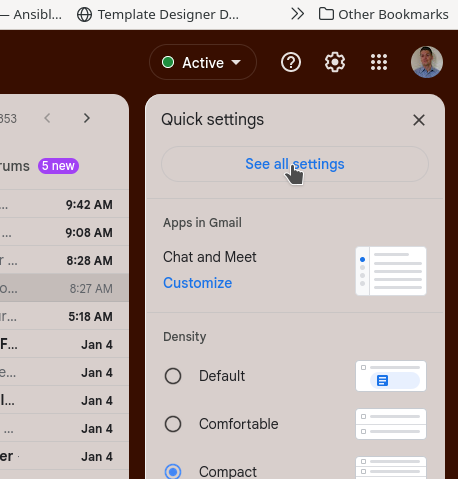
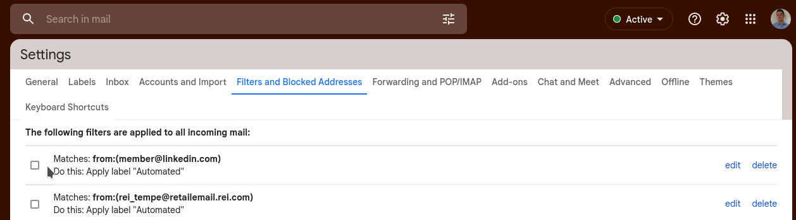
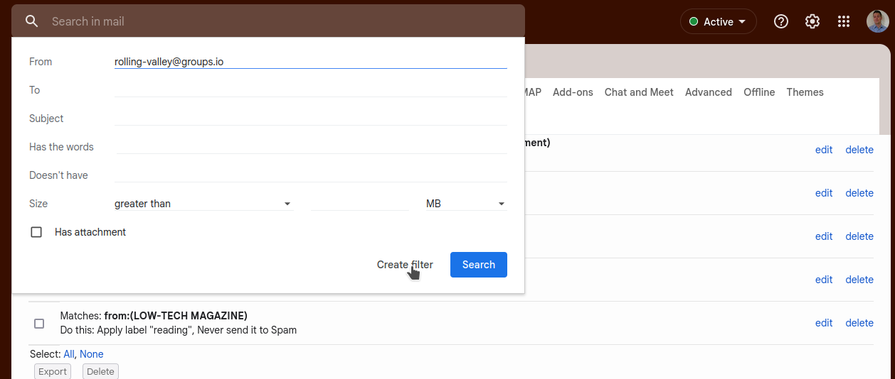
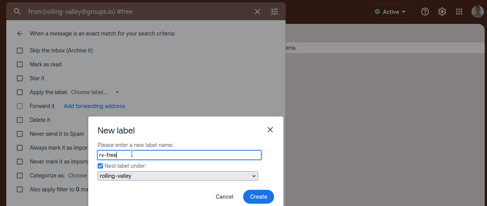

Rolling Valley Neighborhood Wiki
################################

Hashtags
--------

Sticking with some hashtags help others categorize and prioritize messages. This allows you to be in control of what you are interested in and not an algorithm.

- #free An item is availble for free
- #sale Items for sale, needs minimum/suggested price, and possibly contact/pickup information
- #want request for foo, needing a thing for X, eg wanting a couple people to move a couch
- #play activity related, looking for a partner for running or quilting
- #pool Rolling Valley Dolphins pool
- #help need help with something or if someone is offering help for example yard work
- #bolo be on the look out for X, eg: "#bolo silver chevy volt driving erratically"
- #look 
- #headsup [short notices]
- #huntvalley [school]

Filtering
---------

Filters can be created in your Mail Reader (I have listed help on common Mail clients here). This is **extremely** powerful because you can automatically tune out of topics that might waste your time or that has no relevance to you. If someone is overly chatty (for example Kevin) or if someone brings up controversial topics even after being asked not to, you can automatically move message or delete it.

- `Thunderbird <https://support.mozilla.org/en-US/kb/organize-your-messages-using-filters>`_
- `iOS Mail <https://support.apple.com/guide/icloud/set-up-filtering-rules-mm6b1a3f8a/icloud>`_
- `Outlook <https://support.microsoft.com/en-us/office/set-up-rules-in-outlook-75ab719a-2ce8-49a7-a214-6d62b67cbd41>`_
- `Mac Mail <https://support.apple.com/guide/mail/use-rules-to-manage-emails-you-receive-mlhlp1017/mac>`_

The most prevelant email is, gmail. I have created a filter that can be imported (below) and produced instructions on how to create them

1. Go to settings, by clicking the cog in the upper right hand corner. 

2. Then go to Filters, these two steps can be skipped if you do an advanced search (just start searching then click on search options)

3. Either search for emails from the group (rolling-valley@groups.io) and the Hashtag that you want to filter, then click "Create filter"

4. Then you'll have different options, if you already have a mailing list label or creating a new filter for this group to act as a default location for group mail.

you can copy save as xml and then import it, or download the raw file and import it.

.. code-block:: xml

   <feed xmlns="http://www.w3.org/2005/Atom" xmlns:apps="http://schemas.google.com/apps/2006">
   <title>Mail Filters</title>
   <id>tag:mail.google.com,2008:filters:z0000001672931583017*6295547491123651002,z0000001672931917606*6098330141305684368</id>
   <updated>2023-01-05T15:18:50Z</updated>
   <author>
   <name>Kevin Faulkner</name>
   <email>kondor.6c@gmail.com</email>
   </author>
   <entry>
   <category term="filter"/>
   <title>Mail Filter</title>
   <id>tag:mail.google.com,2008:filter:z0000001672931583017*6295547491123651002</id>
   <updated>2023-01-05T15:18:50Z</updated>
   <content/>
   <apps:property name="from" value="rolling-valley@groups.io"/>
   <apps:property name="label" value="rolling-valley"/>
   <apps:property name="sizeOperator" value="s_sl"/>
   <apps:property name="sizeUnit" value="s_smb"/>
   </entry>
   <entry>
   <category term="filter"/>
   <title>Mail Filter</title>
   <id>tag:mail.google.com,2008:filter:z0000001672931917606*6098330141305684368</id>
   <updated>2023-01-05T15:18:50Z</updated>
   <content/>
   <apps:property name="from" value="rolling-valley@groups.io"/>
   <apps:property name="hasTheWord" value="#free"/>
   <apps:property name="label" value="rolling-valley/rv-free"/>
   <apps:property name="sizeOperator" value="s_sl"/>
   <apps:property name="sizeUnit" value="s_smb"/>
   </entry>
   <entry>
   <category term="filter"/>
   <title>Mail Filter</title>
   <id>tag:mail.google.com,2008:filter:z0000001672931917606*6098330141305684368</id>
   <updated>2023-01-05T15:18:50Z</updated>
   <content/>
   <apps:property name="from" value="rolling-valley@groups.io"/>
   <apps:property name="hasTheWord" value="#bolo"/>
   <apps:property name="label" value="rolling-valley/rv-bolo"/>
   <apps:property name="sizeOperator" value="s_sl"/>
   <apps:property name="sizeUnit" value="s_smb"/>
   </entry>
   <entry>
   <category term="filter"/>
   <title>Mail Filter</title>
   <id>tag:mail.google.com,2008:filter:z0000001672931917606*6098330141305684368</id>
   <updated>2023-01-05T15:18:50Z</updated>
   <content/>
   <apps:property name="from" value="rolling-valley@groups.io"/>
   <apps:property name="hasTheWord" value="#huntvalley"/>
   <apps:property name="label" value="rolling-valley/rv-huntvalley"/>
   <apps:property name="sizeOperator" value="s_sl"/>
   <apps:property name="sizeUnit" value="s_smb"/>
   </entry>
   <entry>
   <category term="filter"/>
   <title>Mail Filter</title>
   <id>tag:mail.google.com,2008:filter:z0000001672931917606*6098330141305684368</id>
   <updated>2023-01-05T15:18:50Z</updated>
   <content/>
   <apps:property name="from" value="rolling-valley@groups.io"/>
   <apps:property name="hasTheWord" value="#want"/>
   <apps:property name="label" value="rolling-valley/rv-want"/>
   <apps:property name="sizeOperator" value="s_sl"/>
   <apps:property name="sizeUnit" value="s_smb"/>
   </entry>
   <entry>
   <category term="filter"/>
   <title>Mail Filter</title>
   <id>tag:mail.google.com,2008:filter:z0000001672931917606*6098330141305684368</id>
   <updated>2023-01-05T15:18:50Z</updated>
   <content/>
   <apps:property name="from" value="rolling-valley@groups.io"/>
   <apps:property name="hasTheWord" value="#sale"/>
   <apps:property name="label" value="rolling-valley/rv-sale"/>
   <apps:property name="sizeOperator" value="s_sl"/>
   <apps:property name="sizeUnit" value="s_smb"/>
   </entry>
   <entry>
   <category term="filter"/>
   <title>Mail Filter</title>
   <id>tag:mail.google.com,2008:filter:z0000001672931917606*6098330141305684368</id>
   <updated>2023-01-05T15:18:50Z</updated>
   <content/>
   <apps:property name="from" value="rolling-valley@groups.io"/>
   <apps:property name="hasTheWord" value="#play"/>
   <apps:property name="label" value="rolling-valley/rv-play"/>
   <apps:property name="sizeOperator" value="s_sl"/>
   <apps:property name="sizeUnit" value="s_smb"/>
   </entry>
   <entry>
   <category term="filter"/>
   <title>Mail Filter</title>
   <id>tag:mail.google.com,2008:filter:z0000001672931917606*6098330141305684368</id>
   <updated>2023-01-05T15:18:50Z</updated>
   <content/>
   <apps:property name="from" value="rolling-valley@groups.io"/>
   <apps:property name="hasTheWord" value="#pool"/>
   <apps:property name="label" value="rolling-valley/rv-pool"/>
   <apps:property name="sizeOperator" value="s_sl"/>
   <apps:property name="sizeUnit" value="s_smb"/>
   </entry>
   </feed>

.. literalinclude:: rolling_valley_gmail_filters_2023-01-05.xml
   :language: xml

